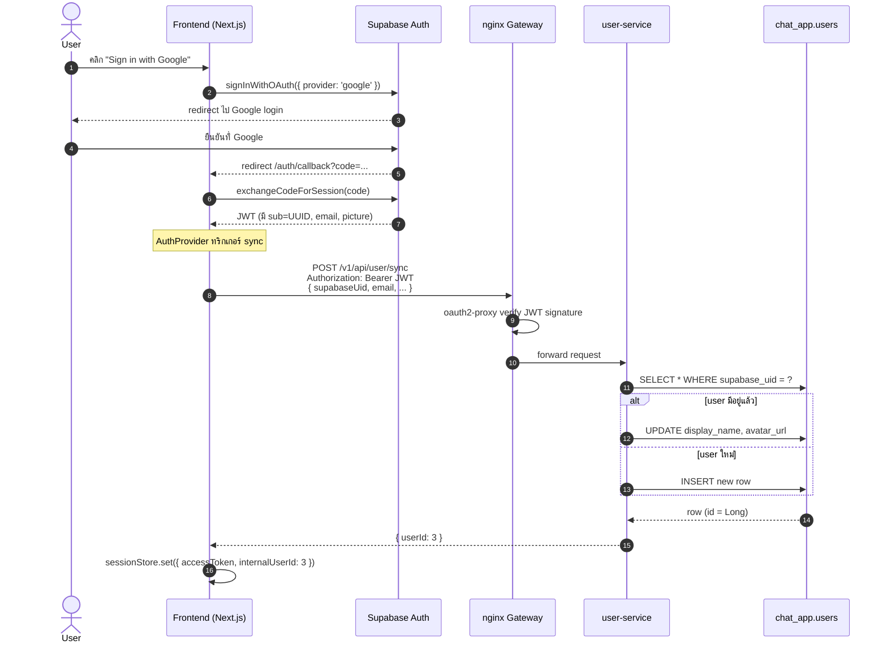
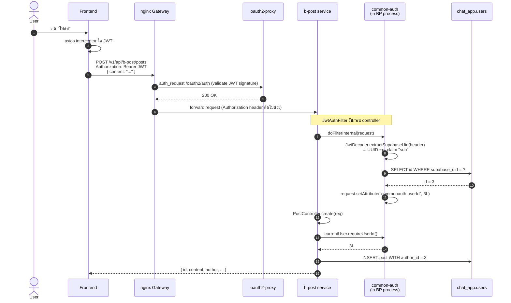

# Auth Architecture — Sandbox Project

เอกสารสรุป flow auth ทั้งหมดของโปรเจกต์ ใช้ดูภาพรวมและเป็น reference เวลา debug หรือเพิ่ม service ใหม่

---

## 📑 สารบัญ

1. [ภาพรวม 2 ชั้น (Centralized vs Service-specific)](#1-ภาพรวม-2-ชั้น)
2. [User เก็บที่ไหนบ้าง](#2-user-เก็บที่ไหนบ้าง)
3. [Login flow (ครั้งแรก)](#3-login-flow-ครั้งแรก)
4. [Request flow (ทุกครั้งที่เรียก API)](#4-request-flow-ทุกครั้งที่เรียก-api)
5. [Internal flow ของ `JwtAuthFilter`](#5-internal-flow-ของ-jwtauthfilter)
6. [เปรียบเทียบแต่ละ service](#6-เปรียบเทียบแต่ละ-service)
7. [`common-auth` library — มีอะไร ทำอะไร](#7-common-auth-library)
8. [Build & deploy flow (Docker)](#8-build--deploy-flow-docker)
9. [Common pitfalls](#9-common-pitfalls)

---

## 1) ภาพรวม 2 ชั้น

Auth ในโปรเจกต์แบ่งเป็น 2 ชั้นชัดเจน:

```
┌─────────────────────────────────────────────────────────────────────┐
│  🟦 LAYER 1 — CENTRALIZED (ทุก service ใช้ร่วมกัน)                   │
├─────────────────────────────────────────────────────────────────────┤
│  • Supabase Auth (auth.users) — issuer ของ JWT                      │
│  • nginx + oauth2-proxy       — verify signature ของ JWT            │
│  • chat_app.users (table)     — shared identity table                │
│  • user-service               — upsert chat_app.users (POST /sync)   │
│  • Frontend AuthProvider      — เรียก /sync, เก็บ JWT               │
└─────────────────────────────────────────────────────────────────────┘
                               │
                               │ JWT (Authorization: Bearer ...)
                               ▼
┌─────────────────────────────────────────────────────────────────────┐
│  🟩 LAYER 2 — SERVICE-SPECIFIC (แต่ละ service มี filter ของตัวเอง)  │
├─────────────────────────────────────────────────────────────────────┤
│  • common-auth library — bundled in each service jar                │
│    └─ JwtAuthFilter → resolve JWT.sub → chat_app.users.id           │
│    └─ CurrentUser    → controller ใช้ requireUserId()                │
└─────────────────────────────────────────────────────────────────────┘
```

**กฎทั่วไป**: ถ้า service มี endpoint ที่ "อ่าน/เขียนข้อมูลของ user คนนั้น" → ต้องใช้ `common-auth` ห้าม trust client

---

## 2) User เก็บที่ไหนบ้าง

```
┌──────────────────┐     ┌──────────────────┐     ┌──────────────────┐
│ Supabase         │     │ chat_app.users   │     │ b_post / chat-app│
│ (auth.users)     │     │                  │     │                  │
│                  │     │ id (BIGSERIAL)   │     │ ทุก FK ชี้ไปที่   │
│ UUID (sub)       │◄────┤ supabase_uid     │◄────┤ chat_app.users(id)│
│ email            │ FK  │ display_name     │ FK  │                  │
│ OAuth metadata   │     │ avatar_url       │     │ posts.author_id  │
│                  │     │ last_seen_at     │     │ chats.sender_id  │
└──────────────────┘     └──────────────────┘     └──────────────────┘
   ↑ จัดการโดย              ↑ source of truth        ↑ ไม่มี user table
   Supabase Auth             user-service เป็นคน      ของตัวเอง — ใช้
   (เราไม่แตะ)               upsert ผ่าน /sync       chat_app.users ร่วม
```

**สรุป**: มี user เก็บแค่ 2 ที่จริง ๆ — Supabase Auth (identity) และ `chat_app.users` (application)

---

## 3) Login flow (ครั้งแรก)



**สรุป**: หลัง login frontend จะถือ 2 ค่า — `accessToken` (JWT) และ `internalUserId` (Long id ใน chat_app.users)

---

## 4) Request flow (ทุกครั้งที่เรียก API)

ตัวอย่าง: user สร้างโพสต์ใน b-post



**Trust boundary 2 ชั้น:**
- **ชั้น 1 (gateway)** — verify ลายเซ็นของ JWT ด้วย Supabase public key และ explicit forward `Authorization` header ไปให้ backend
- **ชั้น 2 (JwtAuthFilter)** — แค่ decode payload เพื่อตรวจสอบเวลาหมดอายุ (`exp`) และดึง `sub` ไม่ verify signature ซ้ำ (เชื่อ gateway แล้ว)

---

## 5) Internal flow ของ `JwtAuthFilter`

```
┌──────────────────────────────────────────────────────────────────┐
│  doFilterInternal(request, response, chain)                       │
│  ─────────────────────────────────────────                        │
│                                                                    │
│   ① อ่าน header                                                    │
│      String header = request.getHeader("Authorization");          │
│                                                                    │
│   ② Decode JWT payload (no signature verify)                      │
│      UUID uid = JwtDecoder.extractSupabaseUid(header);            │
│      // - ตัด "Bearer " ออก                                       │
│      // - split JWT 3 ส่วน                                        │
│      // - Base64-decode ส่วน payload                               │
│      // - parse JSON, อ่าน claim "sub"                            │
│                                                                    │
│   ③ ถ้ามี UID → resolve เป็น Long id                              │
│      if (uid != null) {                                            │
│        request.setAttribute(ATTR_SUPABASE_UID, uid.toString());   │
│        userRepo.findBySupabaseUid(uid)                            │
│          .ifPresent(u ->                                           │
│            request.setAttribute(ATTR_USER_ID, u.getId()));         │
│      }                                                             │
│                                                                    │
│   ④ ส่งต่อให้ filter chain ถัดไป                                  │
│      chain.doFilter(request, response);                            │
└──────────────────────────────────────────────────────────────────┘
                              │
                              ▼
┌──────────────────────────────────────────────────────────────────┐
│  Controller ใช้ CurrentUser อ่าน attribute                        │
│  ─────────────────────────────────────                            │
│   Long me = currentUser.requireUserId();                          │
│   // → อ่าน request.getAttribute("commonauth.userId")             │
│   // → ถ้า null throw UnauthorizedException → 401                 │
└──────────────────────────────────────────────────────────────────┘
```

**ทำไมไม่ verify signature ซ้ำใน filter?**
- Gateway (oauth2-proxy) verify แล้วครั้งหนึ่ง — verify ซ้ำเปลือง CPU
- ถ้าเปลี่ยน Supabase project / หมุน key → แก้ที่ gateway ที่เดียว
- **เงื่อนไข**: backend services ต้องเข้าได้แค่ผ่าน gateway เท่านั้น (ห้ามเปิด port ตรงออกนอก)

---

## 6) เปรียบเทียบแต่ละ service

| ประเด็น | 🟩 b-post | 🟩 chat-app | 🟧 dinner | 🟦 user-service |
|--------|----------|------------|----------|----------------|
| ใช้ common-auth? | ✅ | ✅ | ✅ | ❌ (เป็น issuer) |
| JwtAuthFilter รัน path ไหน | `/v1/api/b-post/*` | `/v1/api/chat-app/*` | `/v1/api/dinner/*` | — |
| Resolve current user จากอะไร | JWT.sub → DB lookup | JWT.sub → DB lookup | JWT.sub → DB lookup | JWT.sub เทียบกับ request body |
| Endpoint per-user | ✅ Posts, Comments, Friends, Messages | ✅ Chat, Rooms | ❌ มีแค่ supplier inquiry | ✅ POST /sync |
| Endpoint ต้องมี Bearer JWT | ✅ ทุก endpoint | ✅ ทุก endpoint | ✅ ทุก endpoint | ✅ |

**dinner**: ใช้ `common-auth` แล้วเพื่อป้องกันช่องโหว่และ security gap หากมีการเพิ่ม endpoint ผูกกับ user ในอนาคต
**user-service**: เป็นคน "สร้าง" identity จึงไม่ได้ใช้ filter ตรงๆ — แต่มีการเช็ค validate `sub` ใน JWT เทียบกับ `supabaseUid` ที่รับมาตอน `/sync` เพื่อป้องกันการสวมรอยแก้อัปเดต Profile คนอื่น

---

## 7) `common-auth` library

### 📦 อยู่ที่ไหน

```
backend/common-auth/
├── pom.xml                       (com.sandbox.sandman:common-auth:0.1.0)
└── src/main/java/com/sandbox/sandman/backend/commonauth/
    ├── JwtDecoder.java           ← static utility
    ├── JwtAuthFilter.java        ← Servlet filter
    ├── CurrentUser.java          ← @Component helper
    ├── UnauthorizedException.java ← 401 marker
    ├── AuthUser.java             ← @Entity → chat_app.users
    └── AuthUserRepository.java   ← findBySupabaseUid + searchByDisplayName
```

### ⚙️ ทำงานในแต่ละ service ยังไง

```
common-auth = LIBRARY (jar) ไม่ใช่ service
                │
                │ ตอน build
                ▼
┌──────────────────────────────────────────────────┐
│ bpost backend.jar                                  │
│ ├── BOOT-INF/classes/    (โค้ด bpost)              │
│ └── BOOT-INF/lib/                                  │
│     └── common-auth-0.1.0.jar  ⭐                  │
│         ├── JwtDecoder.class                       │
│         ├── JwtAuthFilter.class                    │
│         ├── CurrentUser.class                      │
│         └── ...                                    │
└──────────────────────────────────────────────────┘
                │
                │ ตอน runtime
                ▼
   JVM โหลดทั้ง bpost classes + common-auth classes
   เข้าด้วยกัน → Spring scan เจอ @Component, @Entity,
   @Repository → register ใน context → ทำงาน in-process
```

### 🔌 วิธี wire เข้า service ใหม่ (3 ขั้น)

**ขั้น 1**: เพิ่ม dependency ใน `pom.xml`

```xml
<dependency>
    <groupId>com.sandbox.sandman</groupId>
    <artifactId>common-auth</artifactId>
    <version>0.1.0</version>
</dependency>
```

**ขั้น 2**: สร้าง `config/FilterRegistration.java` lock filter ไว้ที่ path ของ service

```java
@Configuration
public class FilterRegistration {
    @Bean
    public FilterRegistrationBean<JwtAuthFilter> jwtFilterRegistration(JwtAuthFilter filter) {
        FilterRegistrationBean<JwtAuthFilter> reg = new FilterRegistrationBean<>(filter);
        reg.addUrlPatterns("/v1/api/<service>/*");
        reg.setOrder(1);
        return reg;
    }
}
```

**ขั้น 3**: ใน controller inject `CurrentUser` แทนการรับ userId จาก path/body

```java
@RestController
@RequiredArgsConstructor
public class FooController {
    private final CurrentUser currentUser;

    @PostMapping("/foo")
    public Result create(@RequestBody Req req) {
        Long me = currentUser.requireUserId(); // ← มาจาก JWT ปลอมไม่ได้
        return service.create(me, req);
    }
}
```

อย่าลืมเพิ่ม `UnauthorizedException` handler ใน `GlobalExceptionHandler` → 401

---

## 8) Build & deploy flow (Docker)

```
┌─────────────────────────────────────────────────────────────────┐
│ Local dev                                                        │
└─────────────────────────────────────────────────────────────────┘

  $ docker compose build bpost-service

       │
       │ docker-compose.yml: context = ./backend, dockerfile = bpost/Dockerfile
       ▼

┌─────────────────────────────────────────────────────────────────┐
│ Stage 1 — Builder (maven:3.9.6-eclipse-temurin-21)               │
│                                                                   │
│  WORKDIR /build                                                   │
│  ① COPY common-auth/pom.xml + src                                 │
│  ② RUN  cd common-auth && mvn install   ← ใส่ ~/.m2 ของ image    │
│  ③ COPY bpost/pom.xml                                             │
│  ④ RUN  mvn dependency:go-offline       ← cache deps             │
│  ⑤ COPY bpost/src                                                 │
│  ⑥ RUN  mvn clean package               ← มี common-auth ฝัง     │
│                                                                   │
│  ผลลัพธ์: /build/bpost/target/backend-0.0.1-SNAPSHOT.jar          │
└─────────────────────────────────────────────────────────────────┘
       │
       │ COPY --from=builder
       ▼
┌─────────────────────────────────────────────────────────────────┐
│ Stage 2 — Runtime (eclipse-temurin:21-jre)                       │
│                                                                   │
│  COPY backend.jar /app/app.jar                                   │
│  ENTRYPOINT java -jar /app/app.jar                               │
│                                                                   │
│  ทิ้ง builder image ไป — image สุดท้ายเล็ก เหลือแค่ JRE + jar     │
└─────────────────────────────────────────────────────────────────┘
       │
       │ docker tag + docker push registry/bpost:tag
       ▼
┌─────────────────────────────────────────────────────────────────┐
│ SIT / Production                                                 │
│   pull image → run container → JVM โหลด common-auth จากภายใน jar │
│   JwtAuthFilter พร้อมทำงาน ✓                                     │
└─────────────────────────────────────────────────────────────────┘
```

### 🔄 Workflow

| ทำอะไร | ต้องรันคำสั่งอะไร |
|-------|------------------|
| แก้แค่ `bpost/src/...` | `docker compose build bpost-service` |
| แก้แค่ `chatapp/src/...` | `docker compose build chat-service` |
| แก้ `common-auth/src/...` | `docker compose build bpost-service chat-service` (rebuild ทั้ง 2) |
| Deploy ขึ้น SIT | `docker compose build` → `docker push` → ส่งคำสั่ง deploy ตามปกติ |

### ⚠️ สิ่งที่ **ไม่** ต้องทำ

- ❌ ไม่ต้อง `mvn install common-auth` ใน CI yml (Dockerfile ทำให้แล้ว)
- ❌ ไม่ต้อง deploy common-auth แยก (ไม่ใช่ service)
- ❌ ไม่ต้องเปิด container/pod ใหม่บน SIT (อยู่ใน jar เดิม)

---

## 9) Common pitfalls

### 🚨 1. JwtAuthFilter ทำงานแต่ `currentUser.requireUserId()` ได้ null

**สาเหตุ**: JWT decode ได้ UUID แล้ว แต่หาใน `chat_app.users` ไม่เจอ → user ยังไม่ได้ sync

**วิธีแก้**: ตรวจว่า frontend เรียก `POST /v1/api/user/sync` ก่อนเรียก endpoint อื่น (`AuthProvider` ทำให้แล้ว)

---

### 🚨 2. แก้ common-auth แล้ว b-post ยังใช้ของเก่า

**สาเหตุ (local dev นอก docker)**: หลังแก้ common-auth ต้องรัน `mvn install` ก่อน ไม่งั้น service ที่ depend on จะไม่เห็นการเปลี่ยนแปลง

**วิธีแก้**:
```bash
cd backend/common-auth && mvn install
cd ../bpost && mvn spring-boot:run
```

ถ้าใช้ Docker → `docker compose build bpost-service` คำสั่งเดียวพอ (Docker layer cache invalidate ให้)

---

### 🚨 3. dinner เคยเรียกได้แม้ไม่มี JWT (อัปเดตแล้ว)

**ได้รับการแก้ไขแล้ว** — ก่อนหน้านี้ `dinner` ไม่ใช้ `common-auth` แต่เพื่อป้องกัน security gap ที่อาจเกิดขึ้นจากการเพิ่ม endpoint ต่อไปในอนาคต ปัจจุบันได้เพิ่มการกรองสิทธิ์และใช้งาน `JwtAuthFilter` ควบคุมการเข้าถึงเรียบร้อยแล้ว

---

### 🚨 4. Frontend เรียก `/chat-app/room/list/3` แล้ว 404

**สาเหตุ**: หลัง refactor chat-app endpoints ตัด `{userId}` ออกจาก path แล้ว — ใช้ `/chat-app/room/list` (ไม่มี id)

**Path mapping ที่เปลี่ยน:**

| เดิม | ใหม่ |
|-----|-----|
| `GET /chat-app/room/list/{userId}` | `GET /chat-app/room/list` |
| `POST /chat-app/room/create/{userId}` | `POST /chat-app/room/create` |
| `POST /chat-app/chat` body มี `senderId` | body ไม่มี `senderId` แล้ว |
| `DELETE /chat-app/comments/{id}?userId=...` | `DELETE /chat-app/comments/{id}` |
| `POST /chat-app/comments/{id}/like/{userId}` | `POST /chat-app/comments/{id}/like` |
| `POST /chat-app/ai/{aiId}/like/{userId}` | `POST /chat-app/ai/{aiId}/like` |
| `POST /chat-app/ai/{aiId}/friend/{userId}` | `POST /chat-app/ai/{aiId}/friend` |
| `GET /chat-app/user/{userId}/friends` | `GET /chat-app/user/friends` |

---

### 🚨 5. Backend ส่ง 401 แต่ frontend ไม่ redirect (แก้ไขแล้ว)

**สาเหตุเดิม**: nginx `error_page 401 = @unauthorized` → redirect `/login` ทำงานเฉพาะบน gateway routes ที่ติด `auth_request` แต่ถ้า backend คืน 401 ออกมาเอง จะไม่ trigger nginx redirect

**วิธีแก้ปัจจุบัน**: เพิ่ม Response Interceptor ใน `frontend/config/axiosConfig.tsx` ดักจับเมื่อมี status 401 จากนั้นล้าง state ออกด้วย `useSessionStore.getState().clear()` แล้ว redirect กลับไปยังหน้า `/login` อย่างสมบูรณ์

---

## 📚 ไฟล์ที่เกี่ยวข้อง

### Common-auth library
- `backend/common-auth/pom.xml`
- `backend/common-auth/src/main/java/com/sandbox/sandman/backend/commonauth/*.java`

### Service wiring
- `backend/bpost/src/main/java/com/sandbox/sandman/backend/config/FilterRegistration.java`
- `backend/chatapp/src/main/java/com/sandbox/sandman/backend/config/FilterRegistration.java`
- `backend/dinner/src/main/java/com/sandbox/sandman/backend/dinner/config/FilterRegistration.java`
- `backend/{bpost,chatapp}/src/main/java/com/sandbox/sandman/backend/error/GlobalExceptionHandler.java`

### User-service (sync endpoint)
- `backend/user/src/main/java/com/sandbox/sandman/backend/controllers/UserController.java`
- `backend/user/src/main/java/com/sandbox/sandman/backend/services/UserResolutionService.java`

### Frontend auth
- `frontend/lib/supabase/client.ts`
- `frontend/providers/AuthProvider.tsx`
- `frontend/stores/sessionStore.ts`
- `frontend/config/axiosConfig.tsx` (ใส่ Bearer token)
- `frontend/middleware.ts` (route guards)

### Gateway
- `gateway/nginx.conf.template` (oauth2-proxy + routing)
- `docker-compose.yml` (oauth2-proxy service)

### Docker build
- `backend/bpost/Dockerfile`
- `backend/chatapp/Dockerfile`
- `backend/.dockerignore`
- `docker-compose.yml` (build context)
